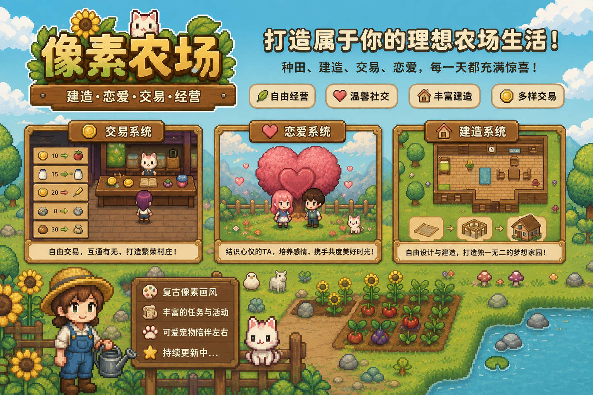

# 你好，我是 Link 👋

---

### 🧑‍💻 关于我

- 🔭 目前专注于 **游戏开发项目**
- 🌱 正在学习 **Godot 引擎 & 游戏设计**
- 👯 期待合作 **开源游戏项目**
- 💬 欢迎交流 **Godot、游戏机制或技术话题**
- 📫 联系方式：**1216476362@qq.com**
- ⚡ 小趣味：**把创意变成可玩的世界**

---

### 🛠️ 软件技能

  &nbsp;&nbsp;
  &nbsp;&nbsp;
  &nbsp;&nbsp;
  &nbsp;&nbsp;
  &nbsp;&nbsp;
  &nbsp;&nbsp;
  &nbsp;&nbsp;
  
    
  &nbsp;&nbsp;
  &nbsp;&nbsp;
  

---

### 📊 GitHub 统计

---

### 🏆 GitHub 奖杯

  

---

### 🎮 精选项目

  

---

  <i>一起创造精彩！🚀</i>

